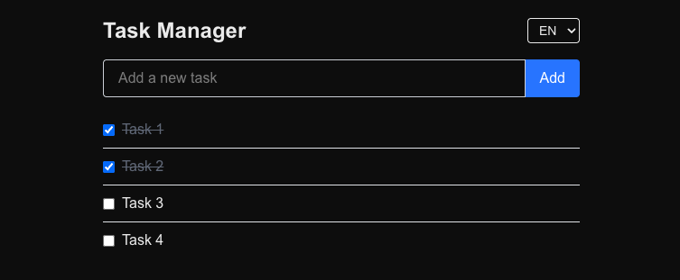

# Task Manager

Simple task manager built with Next.js (App Router), React, and TypeScript. View tasks, add new ones, and toggle completion.



## Getting Started

```bash
yarn install
yarn dev
```

Open [http://localhost:3000](http://localhost:3000). Use **Go to Tasks** to open the task list.

### Environment

Optional: create a `.env.local` file. The frontend reads:

- `NEXT_PUBLIC_API_BASE_URL` – base URL for the API (default: `http://localhost:3000`; set in production to your app origin or API host).

Config is centralized in `app/config/client.ts`.

### Translation (i18n, no library)

UI and API error messages are translated via a small in-app i18n layer. Locale is stored in `localStorage` (`task-manager-locale`) and defaults to `en`. A language switcher (PT/EN) appears on the home and tasks pages. Translations live in `app/locales/en.json` and `app/locales/pt.json`. The context `app/context/LocaleContext.tsx` exposes `useLocale()` with `locale`, `setLocale`, and `t(key, params?)` for interpolation (e.g. `t('task.markComplete', { title })`). Known API error messages are mapped to keys in `API_MESSAGE_TO_KEY` so they can be shown in the active locale.

## API

| Method | Endpoint | Description |
|--------|----------|-------------|
| GET | `/api/tasks` | List all tasks |
| POST | `/api/tasks` | Create a task (body: `{ "title": "string" }`) |
| PATCH | `/api/tasks/:id` | Update a task (body: `{ "title"?: string, "completed"?: boolean }`) |

Error responses use the shape `{ "error": { "message": "string" } }`. Status codes: 200, 201, 400, 404, 500.

## Error handling pattern

We use a single, consistent pattern from API to UI:

1. **API (route handlers)**  
   On validation or business errors, return `{ "error": { "message": "string" } }` with the right status (400, 404, 500). No extra fields; the client only needs `error.message` to show to the user.

2. **Client (service layer)**  
   In `app/tasks/services/tasks.service.ts`, a shared `handleResponse` checks `response.ok`. If not OK, it reads the JSON body, takes `data?.error?.message` (or falls back to `response.statusText`), and **throws `new Error(message)`**. So every failed request becomes a thrown `Error` with a user-facing message. Callers don’t deal with status codes or response shape.

3. **UI (where to catch and how to show)**  
   - **Blocking / full-screen:** For “can’t continue without data” (e.g. initial list load) or after reverting an optimistic update (e.g. toggle failed), we set a single `error` state and render a full-screen error view: the message from the API and a **Retry** action (e.g. reload list).  
   - **Inline / contextual:** For actions that don’t block the rest of the screen (e.g. create task), we catch in the component that triggered the request and show the message **inline** (e.g. below the form), without clearing the list. User can correct and try again.  
   - We always use the **message from the API** when available (`e instanceof Error ? e.message : fallback`), so the same contract drives both API and UI.

4. **Optimistic updates**  
   For toggle, we update UI first, then call the API. On failure we **revert** local state and then follow the full-screen pattern above (set error, show Retry).

In short: **API returns a single error shape → service turns failures into thrown `Error(message)` → UI catches and either shows full-screen + Retry or inline message, using that message everywhere.**

## Tests

```bash
yarn test
```

Runs Jest with React Testing Library. **Components:** TaskItem, TaskList, TaskForm (rendering and user actions). **Hooks:** `useTasks` (load on mount, error state, handleCreated, handleToggle with revert on error, loadTasks retry) and `useTaskForm` (initial state, setTitle, handleSubmit with trim/onCreated/error).

## Technical decisions

- **Hooks for business logic:** List and form logic live in `app/tasks/hooks/` (`useTasks`, `useTaskForm`). The page and `TaskForm` only consume the hook and render: state, side effects, and API calls stay in the hooks so the UI stays presentational and the logic is testable and reusable.
- **Single source of truth for types:** The `Task` type lives in `app/types/task.ts` and is used by both API and frontend so request/response contracts stay consistent.
- **Config from env:** The frontend uses `app/config/client.ts` to read `NEXT_PUBLIC_API_BASE_URL` instead of hardcoding the API base. This keeps the app environment-agnostic and documentable via `.env.example`.
- **Consistent API errors:** All error responses use the shape `{ "error": { "message": "string" } }` and appropriate status codes (400, 404, 500). Message strings are centralized in `app/constants/apiErrors.ts` (`API_ERROR_MESSAGE`) so backend and service use the same copy and the client can rely on a stable contract.
- **Optimistic UI for toggle:** When the user toggles a task’s completion, the checkbox updates immediately (optimistic update). If the PATCH request fails, the state is reverted and an error message is shown. This improves perceived performance and handles the “success most of the time” case without blocking the UI; the failure path is explicit and recoverable via “Retry”.
- **Error handling and display:** All API errors are handled and shown to the user: (1) Initial load failure → full-screen error with message from the API and a “Retry” button. (2) Toggle (PATCH) failure → revert optimistic update and show the same error screen with “Retry”. (3) Create task (POST) failure → error message shown inline below the form (message from API when available), without leaving the list; user can fix and submit again.

## Scale, reliability, observability (future)

- **Scale:** In-memory store is fine for a single instance. For more users or data: move to a database (e.g. Postgres), add pagination on GET, and consider caching (e.g. React Query) and rate limiting on the API.
- **Reliability:** Validation and typed errors are in place. Next steps: retries with backoff for transient failures, idempotency keys for POST/PATCH where applicable, and circuit breakers if calling external services.
- **Observability:** Add structured logging (e.g. request id, status, duration), metrics (request count, latency, error rate), and optional distributed tracing (e.g. OpenTelemetry) for debugging and monitoring.
